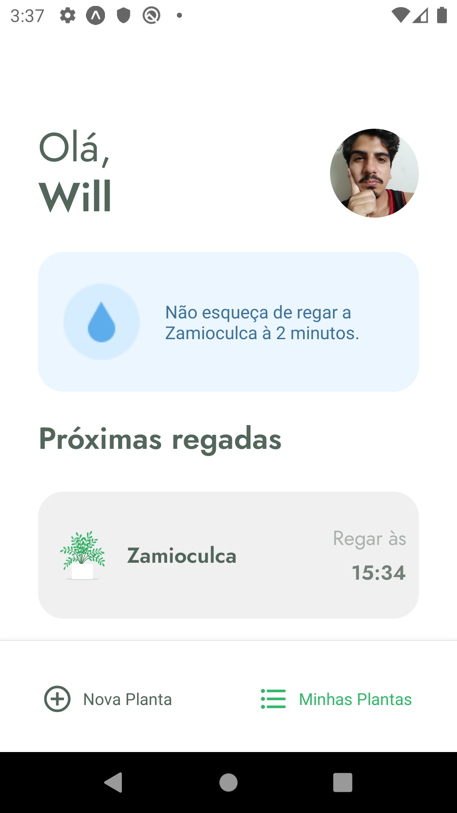
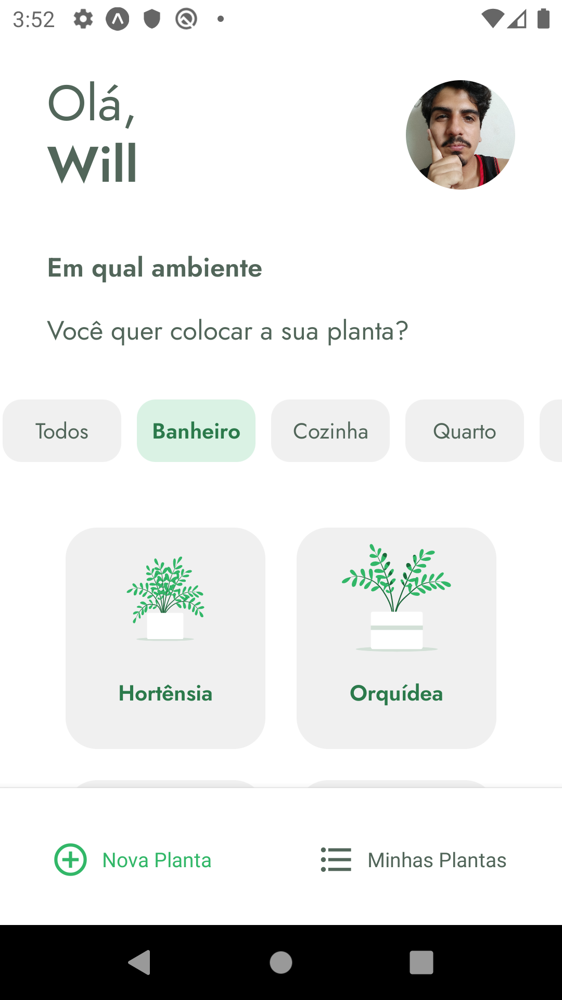
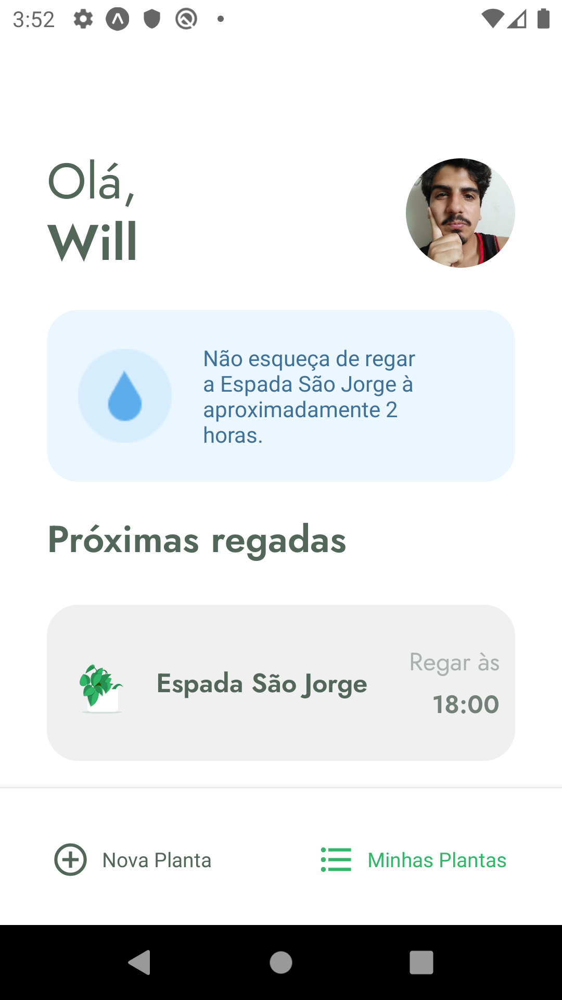

<h1 align="center">Plant Manager</h1>
<p align="center">A manager to remind you to water your plants 🤗</p>


## Table of Contents
- [Screenshots](#screenshots)
- [Technologies](#techs)
- [Installing](#installing)

### Screenshots

<p float="left" >
  
  
  
</p>

### Techs

- [React Native](reactnative.dev)
- [Expo](expo.io)
- [TypeScript](www.typescriptlang.org)
- [Lottie](lottiefiles.com/featured)
- [JSON Server](github.com/typicode/json-server)

### Installing

```shell
# Clone
$ git clone git@github.com:williamtorres1/plant-manager.git

# Access the folder
$ cd plant-manager

# Install the dependencies
$ yarn

# Install json-server
$ sudo yarn global add json-server

# Run fake api with json-server
json-server src/services/server.json --host 10.0.0.3  --port 3333 --delay 700

# Run
$ yarn start

# The server will run on port 19000 - <http://localhost:19000>

```
